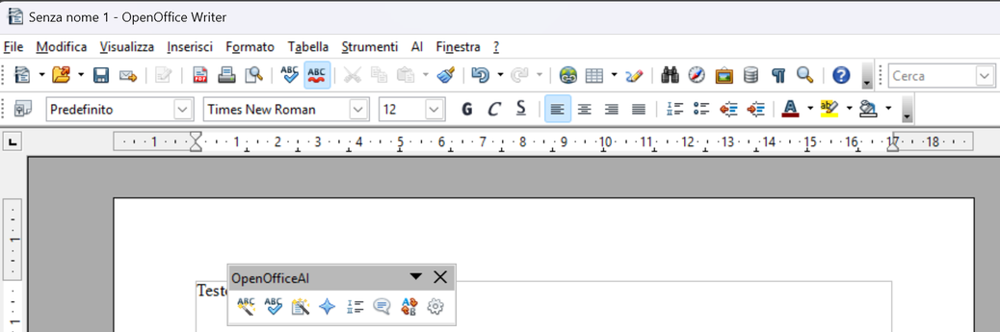
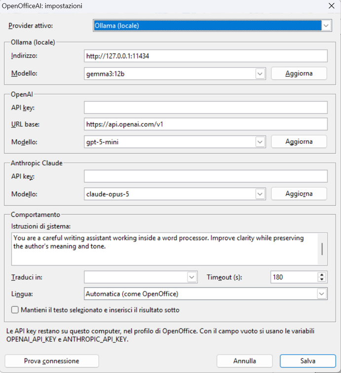

# 🧠 OpenOfficeAI for OpenOffice / LibreOffice

**AI writing tools inside OpenOffice Writer**: select the text, press a button, the result goes into the document.
Works with **local Ollama models** (free and offline) and, if you like, with **OpenAI** and **Anthropic Claude** through your own API key.

**Strumenti di scrittura con intelligenza artificiale dentro OpenOffice Writer**: selezioni il testo, premi un tasto, il risultato va nel documento.
Funziona con i **modelli locali di Ollama** (gratuiti e offline) e, se vuoi, con **OpenAI** e **Anthropic Claude** tramite la tua API key.

**[English](#english) · [Italiano](#italiano)**

---

**Author / Autore:** [MetaDarko](https://github.com/ShinRalexis)  
**Year / Anno:** 2025-2026  
**Version / Versione:** 2.0.0

---

# English

## 🆕 What's new in version 2.0

Version 1.0 was a macro you had to copy by hand and wire to toolbar buttons one by one. Version 2.0 is a **complete extension**:

- 📦 **`.oxt` extension**: install it with a double click, no files to copy and no code to edit.
- 🧰 **Ready-made toolbar and menu**: the **OpenOfficeAI** toolbar with the 7 buttons (plus the settings gear) and the **AI** menu appear by themselves, with icons.
- ⚙️ **Settings dialog**: provider, model, address, API key, system instructions, language and timeout are chosen in a dialog. **Refresh** loads the list of installed models, **Test connection** checks that everything works.
- ☁️ **OpenAI and Anthropic Claude** besides Ollama, with your own API key. The *Base URL* field also accepts OpenAI-compatible servers (LM Studio, vLLM, ...).
- 🌍 **Multilingual**: toolbar, menu, dialogs and messages in Italian, English, Spanish, French and German, following the OpenOffice language or the one chosen in the settings. Answers keep **the language of the selected text** (they used to be always Italian) and **Translate** works towards the language you choose (it used to translate only into Italian).
- 🔤 **Synonyms with replacement**: a list opens and a double click replaces the word (it used to be a read-only popup).
- 📝 **Keep the original**: option to insert the result below the selected text instead of replacing it.
- ↩️ **A single Undo** (Ctrl+Z) restores the original text, and the result stays selected so you can apply another button right away.
- ⏳ **OpenOffice no longer freezes** while waiting: the status bar shows what is happening and with which model.
- 🪟 **Windows installer** (`Installa.bat`) that removes the old 1.0 macro and its hand-made toolbar, keeping a backup.
- 🩺 **Log file** (`openofficeai.log`) to find out what went wrong.

## 🐞 Fixes since 1.0

- **Paragraphs**: the result is written as real paragraphs and keeps the paragraph structure of the original. It used to end up in a single paragraph split by line breaks.
- **System instructions**: now apply to every tool and are sent to the model the proper way. They used to be used only by Improve and Proofread.
- **Reasoning models** (DeepSeek R1, Qwen 3, ...): `<think>` blocks are removed and only the answer reaches the document.
- **No Markdown in the document**: asterisks, hash signs and code blocks no longer end up in the text.
- **Bullet list** with real `•` bullets instead of dashes or asterisks.
- **Readable errors**: Ollama not running, unknown model, wrong API key, exhausted credit or timeout are explained in plain words instead of technical messages.
- **Protected areas**: if the text cannot be written, the result is shown in a dialog to copy. It could previously end up at the end of the document.
- **Double click**: pressing a button while a request is running no longer starts a second request on the same text.
- **HTTPS in OpenOffice's Python**: secure connections, needed for OpenAI and Anthropic, now work in the Python bundled with OpenOffice 4.1.

---

## ⚙️ Installation

### 1️⃣ Download the extension

Download `OpenOfficeAI-2.0.0.oxt` from the [Releases](https://github.com/ShinRalexis/OpenOfficeAI/releases) page,
or build the package from this repository with:

```bash
python build.py
```

### 2️⃣ Install

- **Double click** the `.oxt` file: the OpenOffice Extension Manager opens. Confirm and **restart OpenOffice**.
- **On Windows** you can instead close OpenOffice and run `installer\Installa.bat` (with the `.oxt` file in the same folder).

### 🔄 Upgrading from version 1.0

`Installa.bat` removes the old `ollama_ai.py` and the hand-made toolbar by itself, saving a copy in
`%APPDATA%\OpenOffice\4\user\backup_openofficeai_<date>`. If you install with a double click, delete the old file from
`...\user\Scripts\python\` and the old toolbar from **Tools ▸ Customize** yourself, or you will see duplicate buttons.

Installer options:

```text
Installa.bat                  install or update
Installa.bat -CloseOffice     close the quickstarter first (only if no document is open)
Installa.bat -Uninstall       remove the extension
```

---

## 🔧 Settings

Press the **gear** in the toolbar (or **AI ▸ AI Settings**).



- **Active provider**: Ollama (local), OpenAI or Anthropic Claude.
- **Model**: type it, or pick it from the list after pressing **Refresh**.
- **API key**: only for OpenAI and Anthropic. When the field is empty the `OPENAI_API_KEY` and `ANTHROPIC_API_KEY` environment variables are used.
- **System instructions**: the assistant's role and tone, used by every tool.
- **Translate into**: the target language of *AI Translate* (empty = interface language).
- **Language**: the interface language (automatic = same as OpenOffice).
- **Keep the selected text**: the result is inserted below instead of replacing it.
- **Timeout**: how many seconds to wait for an answer.

Settings are saved in `openofficeai.json` inside the OpenOffice profile (`%APPDATA%\OpenOffice\4\user\`).

### 👉 Recommended Ollama model

```bash
ollama pull gemma3:12b
```

"Gemma 3 12B" is still a great choice for accuracy and speed. `gpt-oss:20b` and similar models work well too;
very small models (1-3B) are fast but fix little.

---

## 🧠 Available tools

| Button | What it does |
|:--------------------------|:--------------------------------------------|
| AI Improve | Improves form and flow without changing the meaning |
| AI Proofread | Fixes only clear errors (spelling, punctuation, syntax) |
| AI Summarize | Summarizes in 3-5 sentences |
| AI Translate | Translates into the language chosen in the settings |
| AI Bullet list | Turns the text into a bulleted list |
| AI Explain | Explains in simple words, with examples |
| AI Synonyms | Suggests alternatives and replaces the word with the chosen one |
| AI Settings | Provider, models, language and behaviour |

## 🚀 Example

1. Select a paragraph.
2. Press **AI Improve** (in the toolbar or in the **AI** menu).
3. Wait for the answer: OpenOffice stays usable.
4. The text is replaced with the improved version. Not happy with it? **Ctrl+Z** brings back the original.

---

## 🔒 Privacy

- With **Ollama** the text never leaves your computer and no Internet connection is needed.
- With **OpenAI** or **Anthropic** the selected text is sent to their servers.
- API keys are stored in plain text only on your computer, in the OpenOffice profile.

## ❗ Requirements

- **Apache OpenOffice 4.1** (uses the bundled Python) or **LibreOffice**.
- For Ollama: [Ollama](https://ollama.com) installed and running, with at least one model (e.g. `gemma3:12b`, `gpt-oss:20b`).
- For OpenAI or Anthropic: an API key and an Internet connection.

## 🩺 Troubleshooting

| Message | What to do |
|---|---|
| Could not connect to `http://127.0.0.1:11434` | Start Ollama |
| No model chosen | Choose a model in **AI Settings** |
| HTTP error 401 | Missing or wrong API key |
| HTTP error 404 | The model name does not exist: press **Refresh** and pick it from the list |
| Timed out | Slow model or long text: raise the **Timeout** |

The OpenOffice profile contains `openofficeai.log` with the commands run and any errors
(it never contains document text or API keys).

---

## 🛠️ Development

```bash
python build.py              # builds dist/OpenOfficeAI-<version>.oxt
python tests/test_core.py    # tests (they also run with OpenOffice's Python)
```

`tests/office_driver.py` runs a full check inside OpenOffice started on a separate profile (instructions at the top of the file).

```text
extension/
  openofficeai_handler.py     UNO component: connects toolbar and menu to the code
  pythonpath/openofficeai/    settings, prompts, providers, dialogs, actions, translations
  icons/                      button icons (from the Apache OpenOffice icon set)
  description/                Extension Manager descriptions
installer/                    Installa.bat and install.ps1 (Windows)
legacy/ollama_ai.py           version 1.0 (single macro)
build.py                      builds toolbar and menu from the translations and packs the .oxt
```

---

## 📜 Version 1.0 (macro)

The first version is still in [`legacy/ollama_ai.py`](legacy/ollama_ai.py): a Python macro to copy into
`...\user\Scripts\python\`, run from **Tools ▸ Macros ▸ Run Macro...** and wired to toolbar buttons by hand.

| The 1.0 toolbar, made by hand | The 1.0 Macro dialog |
|:---:|:---:|
|  |  |

---

## 🧩 License

This project is released under the Apache 2.0 license.
You can modify and redistribute it freely, crediting the author.
Independent project, not affiliated with the Apache Software Foundation, OpenAI or Anthropic.

## 🐞 Bug reports

If you find a problem or unexpected behaviour, open an [Issue on GitHub](https://github.com/ShinRalexis/OpenOfficeAI/issues).

---

# Italiano

## 🆕 Novità della versione 2.0

La 1.0 era una macro da copiare a mano e da collegare ai pulsanti uno per uno. La 2.0 è un'**estensione completa**:

- 📦 **Estensione `.oxt`**: si installa con un doppio clic, niente file da copiare né codice da modificare.
- 🧰 **Barra e menu pronti**: la barra **OpenOfficeAI** con i 7 tasti (più l'ingranaggio delle impostazioni) e il menu **AI** compaiono da soli, con le icone.
- ⚙️ **Finestra Impostazioni**: provider, modello, indirizzo, API key, istruzioni di sistema, lingua e timeout si scelgono da una finestra. Il tasto **Aggiorna** carica l'elenco dei modelli installati, **Prova connessione** verifica che tutto funzioni.
- ☁️ **OpenAI e Anthropic Claude** oltre a Ollama, con la tua API key. Il campo *URL base* accetta anche server compatibili con OpenAI (LM Studio, vLLM, ...).
- 🌍 **Multilingua**: barra, menu, finestre e messaggi in italiano, inglese, spagnolo, francese e tedesco, secondo la lingua di OpenOffice o quella scelta nelle impostazioni. Le risposte restano **nella lingua del testo selezionato** (prima erano sempre in italiano) e **Traduci** traduce verso la lingua che scegli (prima solo verso l'italiano).
- 🔤 **Sinonimi con sostituzione**: si apre un elenco e con un doppio clic la parola viene sostituita (prima era solo un popup da leggere).
- 📝 **Mantieni l'originale**: opzione per inserire il risultato sotto il testo selezionato invece di sostituirlo.
- ↩️ **Un solo Annulla** (Ctrl+Z) ripristina il testo originale, e il risultato resta selezionato per applicare subito un altro tasto.
- ⏳ **OpenOffice non si blocca** durante l'attesa: la barra di stato mostra cosa sta facendo e con quale modello.
- 🪟 **Installer per Windows** (`Installa.bat`) che rimuove la vecchia macro 1.0 e la sua barra fatta a mano, con copia di backup.
- 🩺 **File di log** (`openofficeai.log`) per capire cosa è andato storto.

## 🐞 Fix rispetto alla 1.0

- **Paragrafi**: il risultato ora è scritto in paragrafi veri e mantiene la divisione del testo originale. Prima finiva tutto in un unico paragrafo spezzato da "a capo".
- **Istruzioni di sistema**: ora valgono per tutte le funzioni e sono inviate al modello nel modo corretto. Prima erano usate solo da Migliora ed Editing.
- **Modelli che "ragionano"** (DeepSeek R1, Qwen 3, ...): i blocchi `<think>` vengono rimossi e nel documento arriva solo la risposta.
- **Niente Markdown nel documento**: asterischi, cancelletti e blocchi di codice non finiscono più nel testo.
- **Elenco puntato** con veri pallini `•` invece di trattini o asterischi.
- **Errori comprensibili**: Ollama non avviato, modello inesistente, API key sbagliata, credito esaurito o tempo scaduto sono spiegati in chiaro, invece dei messaggi tecnici.
- **Aree protette**: se il testo non può essere scritto, il risultato viene mostrato in una finestra da copiare. Prima poteva finire in fondo al documento.
- **Doppio clic**: premere un tasto mentre un'elaborazione è in corso non avvia una seconda richiesta sullo stesso testo.
- **HTTPS nel Python di OpenOffice**: le connessioni sicure, necessarie per OpenAI e Anthropic, ora funzionano anche nel Python incluso in OpenOffice 4.1.

---

## ⚙️ Installazione

### 1️⃣ Scarica l'estensione

Scarica `OpenOfficeAI-2.0.0.oxt` dalla pagina [Releases](https://github.com/ShinRalexis/OpenOfficeAI/releases),
oppure crea il pacchetto da questo repository con:

```bash
python build.py
```

### 2️⃣ Installa

- **Doppio clic** sul file `.oxt`: si apre il Gestore estensioni di OpenOffice. Conferma e **riavvia OpenOffice**.
- **Su Windows**, in alternativa, chiudi OpenOffice e avvia `installer\Installa.bat` (con il file `.oxt` nella stessa cartella).

### 🔄 Se avevi la versione 1.0

`Installa.bat` rimuove da solo il vecchio `ollama_ai.py` e la barra creata a mano, salvando una copia in
`%APPDATA%\OpenOffice\4\user\backup_openofficeai_<data>`. Se installi con il doppio clic, elimina tu il vecchio file da
`...\user\Scripts\python\` e la vecchia barra da **Strumenti ▸ Personalizza**, altrimenti vedrai i tasti doppi.

Opzioni dell'installer:

```text
Installa.bat                  installa o aggiorna
Installa.bat -CloseOffice     chiude prima l'avvio rapido (solo se non ci sono documenti aperti)
Installa.bat -Uninstall       rimuove l'estensione
```

---

## 🔧 Impostazioni

Premi l'**ingranaggio** nella barra (oppure **AI ▸ AI Impostazioni**).


- **Provider attivo**: Ollama (locale), OpenAI o Anthropic Claude.
- **Modello**: scrivilo o scegli dall'elenco dopo aver premuto **Aggiorna**.
- **API key**: solo per OpenAI e Anthropic. Se il campo è vuoto si usano le variabili d'ambiente `OPENAI_API_KEY` e `ANTHROPIC_API_KEY`.
- **Istruzioni di sistema**: il ruolo e il tono dell'assistente, valgono per tutte le funzioni.
- **Traduci in**: la lingua di destinazione di *AI Traduci* (vuoto = lingua dell'interfaccia).
- **Lingua**: la lingua dell'interfaccia (automatica = come OpenOffice).
- **Mantieni il testo selezionato**: il risultato viene inserito sotto invece di sostituire.
- **Timeout**: quanti secondi aspettare la risposta.

Le impostazioni sono salvate in `openofficeai.json` nel profilo di OpenOffice (`%APPDATA%\OpenOffice\4\user\`).

### 👉 Modello consigliato con Ollama

```bash
ollama pull gemma3:12b
```

"Gemma 3 12B" resta un'ottima scelta per precisione e prestazioni. Vanno bene anche `gpt-oss:20b` e simili;
i modelli molto piccoli (1-3B) sono veloci ma correggono poco.

---

## 🧠 Funzioni disponibili

| Tasto | Funzione |
|:--------------------------|:--------------------------------------------|
| AI Migliora | Migliora forma e scorrevolezza senza cambiare il significato |
| AI Editing | Corregge solo errori evidenti (ortografia, punteggiatura, sintassi) |
| AI Riassumi | Riassume in 3-5 frasi |
| AI Traduci | Traduce nella lingua scelta nelle impostazioni |
| AI Elenco puntato | Trasforma il testo in un elenco puntato |
| AI Spiega | Spiega in modo semplice, con esempi |
| AI Sinonimi | Propone alternative e sostituisce la parola con quella scelta |
| AI Impostazioni | Provider, modelli, lingua e comportamento |

## 🚀 Esempio d'uso

1. Seleziona un paragrafo.
2. Premi **AI Migliora** (nella barra o nel menu **AI**).
3. Attendi la risposta: OpenOffice resta utilizzabile.
4. Il testo viene sostituito con la versione migliorata. Non ti piace? **Ctrl+Z** e torni all'originale.

---

## 🔒 Privacy

- Con **Ollama** il testo non esce dal tuo computer e non serve Internet.
- Con **OpenAI** o **Anthropic** il testo selezionato viene inviato ai loro server.
- Le API key sono salvate in chiaro solo sul tuo computer, nel profilo di OpenOffice.

## ❗ Requisiti

- **Apache OpenOffice 4.1** (usa il Python incluso) oppure **LibreOffice**.
- Per Ollama: [Ollama](https://ollama.com) installato e in esecuzione, con almeno un modello (es. `gemma3:12b`, `gpt-oss:20b`).
- Per OpenAI o Anthropic: una API key e la connessione a Internet.

## 🩺 Se qualcosa non va

| Messaggio | Cosa fare |
|---|---|
| Connessione non riuscita a `http://127.0.0.1:11434` | Avvia Ollama |
| Nessun modello scelto | Scegli un modello in **AI Impostazioni** |
| Errore HTTP 401 | API key mancante o sbagliata |
| Errore HTTP 404 | Il nome del modello non esiste: premi **Aggiorna** e sceglilo dall'elenco |
| Tempo scaduto | Modello lento o testo lungo: aumenta il **Timeout** |

Nel profilo di OpenOffice trovi `openofficeai.log` con i comandi eseguiti e gli eventuali errori
(non contiene mai il testo dei documenti né le API key).

---

## 🛠️ Sviluppo

```bash
python build.py              # crea dist/OpenOfficeAI-<versione>.oxt
python tests/test_core.py    # test (funzionano anche con il Python di OpenOffice)
```

`tests/office_driver.py` esegue una prova completa dentro OpenOffice avviato con un profilo separato (istruzioni all'inizio del file).

```text
extension/
  openofficeai_handler.py     componente UNO: collega barra e menu al codice
  pythonpath/openofficeai/    impostazioni, prompt, provider, finestre, azioni, traduzioni
  icons/                      icone dei tasti (dal set di Apache OpenOffice)
  description/                descrizioni per il Gestore estensioni
installer/                    Installa.bat e install.ps1 (Windows)
legacy/ollama_ai.py           la versione 1.0 (macro singola)
build.py                      genera barra e menu dalle traduzioni e crea il pacchetto .oxt
```

---

## 📜 Versione 1.0 (macro)

La prima versione è ancora in [`legacy/ollama_ai.py`](legacy/ollama_ai.py): una macro Python da copiare in
`...\user\Scripts\python\`, avviabile da **Strumenti ▸ Macro ▸ Esegui macro...** e da collegare a mano ai pulsanti.

| La barra della 1.0, creata a mano | La finestra Macro della 1.0 |
|:---:|:---:|
|  |  |

---

## 🧩 Licenza

Questo progetto è rilasciato sotto licenza Apache 2.0.
Puoi modificarlo e ridistribuirlo liberamente, citando l'autore.
Progetto indipendente, non affiliato con Apache Software Foundation, OpenAI o Anthropic.

## 🐞 Segnalazione bug

Se trovi un problema o un comportamento anomalo, apri una [Issue su GitHub](https://github.com/ShinRalexis/OpenOfficeAI/issues).
